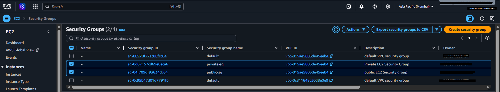
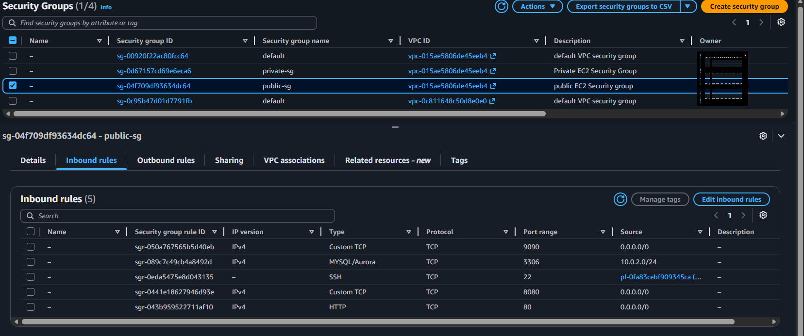
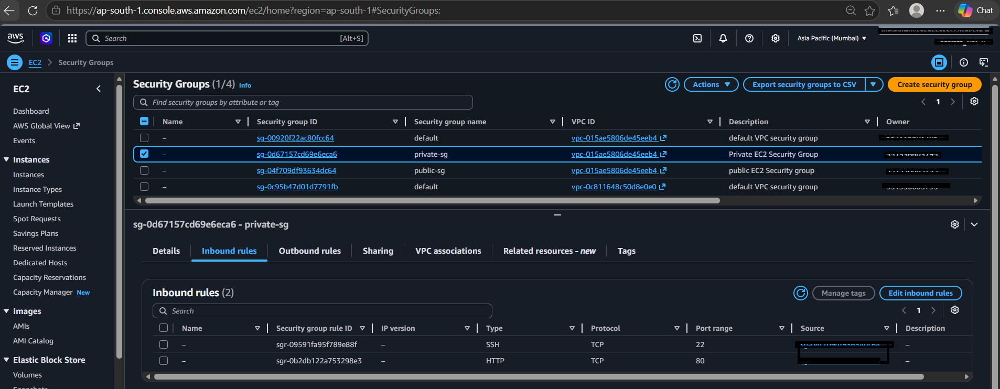

02 - Security Groups

Overview
Security groups act as virtual firewalls controlling inbound and outbound 
traffic for EC2 instances.

Security Groups Created
- `public-sg` → attached to Public EC2
- `private-sg` → attached to Private EC2

Public Security Group (public-sg)

 Inbound Rules
| Type       | Protocol | Port | Source          | Purpose                            |
|------------|----------|------|-----------------|------------------------------------|
| SSH        | TCP      | 22   | My IP           | SSH access from laptop             |
| SSH        | TCP      | 22   | 13.233.177.0/29 | AWS EC2 Instance Connect           |
| HTTP       | TCP      | 80   | 0.0.0.0/0       | BookStack live traffic             |
| Custom TCP | TCP      | 8080 | 0.0.0.0/0       | Blue container                     |
| Custom TCP | TCP      | 9090 | 0.0.0.0/0       | Green container                    |
| MySQL      | TCP      | 3306 | 10.0.2.0/24     | MySQL replication from Private EC2 |

Outbound Rules
| Type        | Port | Destination     |
|-------------|------|-----------------|
| All traffic | All  | 0.0.0.0/0       |

Private Security Group (private-sg)

Inbound Rules
| Type | Protocol | Port | Source    | Purpose                  |
|------|----------|------|-----------|--------------------------|
| SSH  | TCP      | 22   | public-sg | SSH jump from Public EC2 |
| MySQL| TCP      | 3306 | public-sg | MySQL replication        |

Outbound Rules
| Type        | Port | Destination |
|-------------|------|-------------|
| All traffic | All  | 0.0.0.0/0   |

Key Concepts
- Public SG → allows internet traffic on ports 80, 8080, 9090
- Private SG → only allows traffic from Public EC2, never from internet
- Source as SG → using security group as source instead of IP is more secure and dynamic
- Principle of least privilege → only required ports are open

Screenshots

Security Groups List

Public SG Inbound Rules

Private SG Inbound Rules

