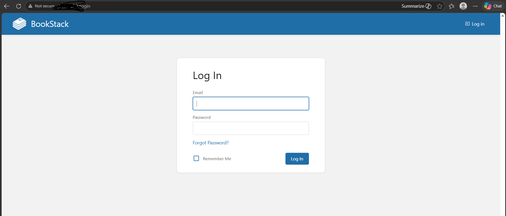
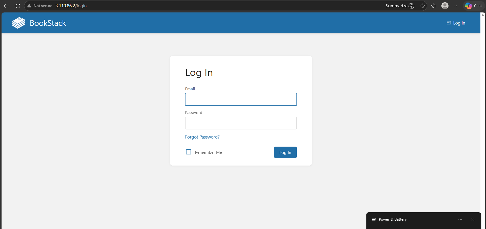
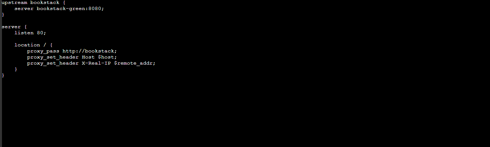

06 - Nginx Blue-Green Deployment

Overview
Nginx acts as a reverse proxy that routes all incoming traffic 
to either the Blue (live) or Green(staging) BookStack container. 
Switching between versions takes zero downtime.

 Architecture
Public Users
↓
Internet Gateway
↓
Nginx (Port 80)
↓
Blue Container (Port 8080) ← Live
OR
Green Container (Port 9090) ← Staging
↓
MySQL (Port 3306)

Blue-Green Strategy
| Environment | Container      | Port | Purpose                 |
|-------------|---             |------|------------------------ |
| Blue        | bookstack-blue | 8080 | Live production traffic |
| Green       | bookstack-green| 9090 | Testing new version     |

Nginx Config
nginx
upstream bookstack {
    server bookstack-blue:8080;
}

server {
    listen 80;

    location / {
        proxy_pass http://bookstack;
        proxy_set_header Host $host;
        proxy_set_header X-Real-IP $remote_addr;
    }
}

Step by Step

Step 1 — Create nginx.conf

nano nginx.conf

Step 2 — Start All Containers

sudo docker-compose up -d

sudo docker ps

Step 3 — Verify Blue is Live

Visit http://your-ec2-public-ip → BookStack loads from Blue ✅

Step 4 — Verify Green is Staging

Visit http://your-ec2-public-ip:9090 → BookStack loads from Green ✅

Step 5 — Switch Traffic to

 Green
nano nginx.conf

Change
server bookstack-blue:8080;

To:
server bookstack-green:8080;

Step 6 — Reload Nginx (Zero Downtime)

sudo docker exec nginx nginx -s reload

Step 7 — Rollback to Blue if needed

nano nginx.conf

# Change back to bookstack-blue:8080

sudo docker exec nginx nginx -s reload

Takes 30 seconds to rollback ✅

Key Concepts

Zero Downtime → Nginx reload doesn't drop connections

Instant Rollback → switch back to Blue in 30 seconds

Same Database → both Blue and Green share same MySQL

Staging → test new version on Green before going live
Files
nginx.conf — Nginx reverse proxy configuration

Screenshots
Files
- [nginx.conf](./nginx.conf) — Nginx reverse proxy configuration

Screenshots

Blue Container - Live (Port 80)

Green Container - Staging (Port 9090)

Nginx Config File

