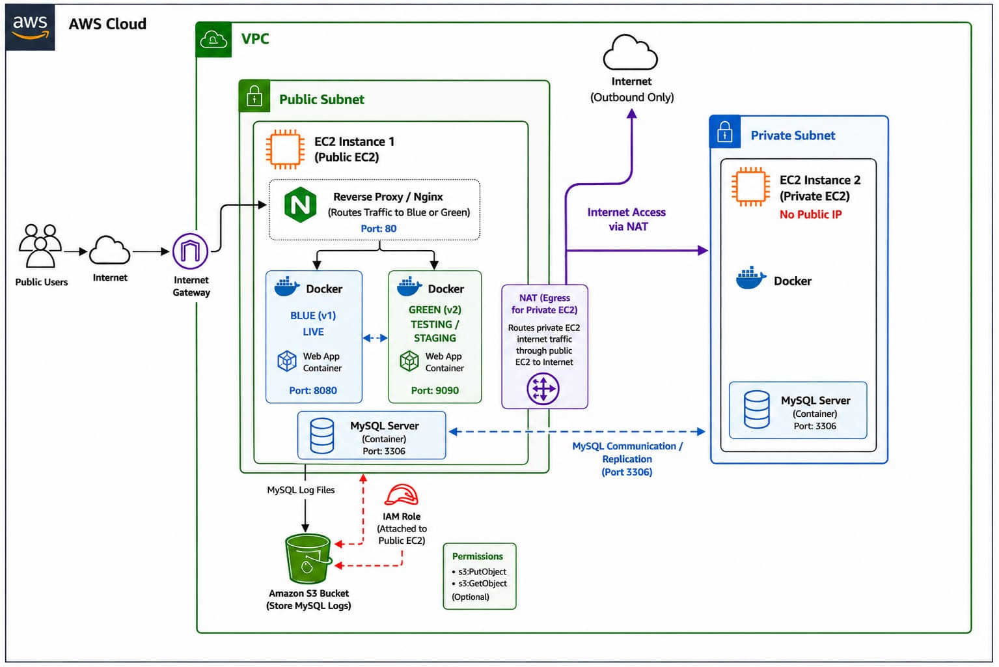

 AWS Docker Blue-Green Deployment

📌 Project Overview

Production-grade AWS infrastructure built from scratch featuring VPC networking, Dockerized web application with Blue-Green deployment strategy, MySQL primary-replica replication across public/private subnets, and automated S3 log storage using IAM roles.

🏗️ Architecture

Problem Statement

What problem does this solve?

Traditional deployment problems:

❌ Downtime during updates

❌ No rollback if something breaks

❌ Single point of failure for database

❌ No log management

Our solution:

✅ Zero downtime with Blue-Green deployment

✅ Instant rollback in 30 seconds

✅ Database backup with MySQL replication

✅ Automated log storage in S3

 🛠️ Tech Stack

- Cloud: AWS (VPC, EC2, S3, IAM, NAT Gateway)
- Containerization: Docker, Docker Compose
- Web Application: BookStack
- Database: MySQL 8.0
- Reverse Proxy:Nginx
- OS:Ubuntu 24.04 LTS

 ✨ Features

- Custom VPC with Public and Private Subnets
- Blue-Green Zero Downtime Deployment
- MySQL Primary-Replica Replication
- Nginx Reverse Proxy Traffic Switching
- Automated MySQL Log Upload to S3
- IAM Role based S3 Authentication
- NAT Gateway for Private EC2 internet access

Future Improvements
What can be added:

Load Balancer instead of single Nginx
Auto scaling for EC2 instances
CloudWatch monitoring and alerts
CI/CD pipeline with GitHub Actions
Terraform for infrastructure as code
SSL/HTTPS certificate
Automated blue-green switching
